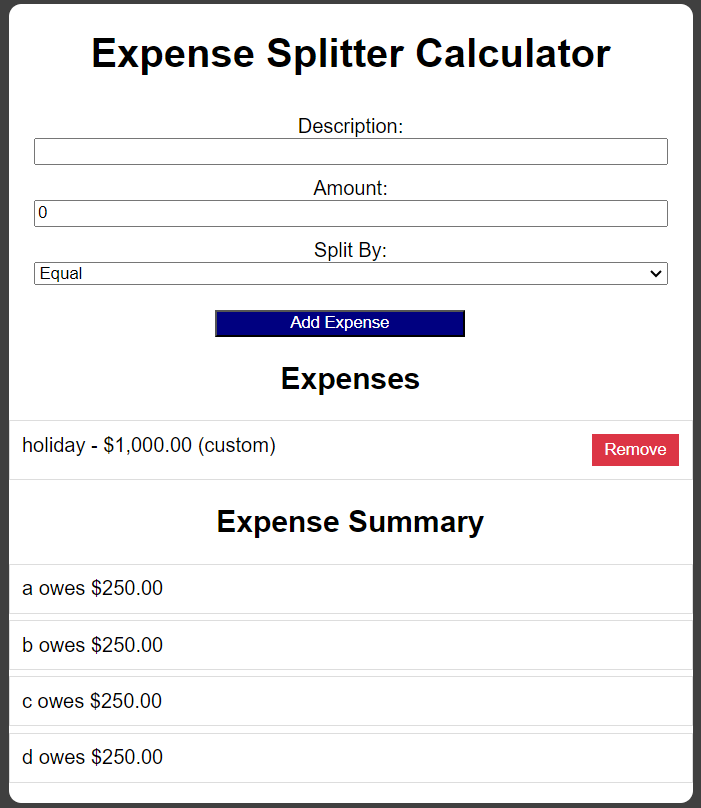

# Split Calculator
A simple **Expense Splitter** calculator built using **AngularJS**. This application helps users split expenses between individuals either equally or custom, based on user-defined splits.

## Features
- Add expenses with descriptions and amounts.
- Choose between splitting expenses equally or by custom names.
- Remove individual expenses.
- Display summary of how much each person owes.

## Technologies Used
- **AngularJS** for dynamic content binding.
- **HTML5** for the structure of the application.
- **CSS** for styling the user interface.

## Screenshots


## How to Run

1. Clone this repository:

    ```bash
    git clone https://github.com/your-username/split-calculator.git
    ```

2. Navigate into the project directory:

    ```bash
    cd split-calculator
    ```

3. Open the `index.html` file in your preferred browser.

## Usage

1. **Add Expense**: Enter a description, amount, and select whether to split equally or customize by adding names separated by commas.
2. **Remove Expense**: Click on the "Remove" button next to any listed expense to delete it.
3. **Summary**: The summary section will display how much each person owes based on the expenses entered.

## Code Structure

- **index.html**: Contains the structure and AngularJS bindings.
- **styles.css**: Handles the styling of the application.
- **AngularJS Controller**: Controls the logic for adding expenses, calculating the split, and displaying the summary.

## Future Enhancements

- Add local storage to save expenses between sessions.
- Add more customization for splitting expenses (e.g., split by percentage).
- Responsive design improvements for better mobile support.

## License

This project is licensed under the MIT License.
